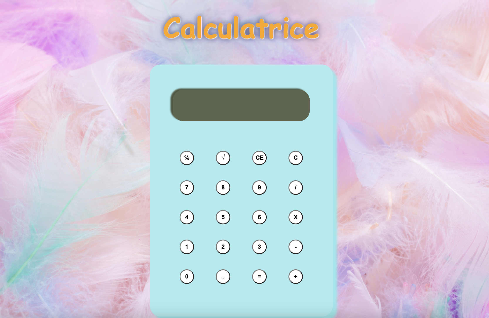

# Calculatrice Y2K
Simple calculatrice créée en HTML, CSS et Javascript.

**Lien vers le site:** https://kure-ru.github.io/Calculator/

## Comment je l'ai fait:

**Technologies utilisées:** HTML, CSS, JavaScript

Ce projet m'a aidé à mettre en pratique mes connaissances sur la programmation orientée objet en JavaScript. J'ai aussi pu consolider mes connaissances sur les event listeners et la manipulation du DOM.

## Optimisations:
J'ai pu diminuer le nombre de lignes de code de manière considérable en utilisant un objet calculatrice. 

## Ce que j'ai appris:
J'ai appris à créer des event listener pour les touches de clavier. Ainsi on peut utiliser la calculatrice sans cliquer sur les boutons. 

## Ca vous a plu?

- [Mon portfolio](https://claireinada.netlify.app/)
- [Twitter](https://twitter.com/home)
- [LinkedIn](https://www.linkedin.com/)

